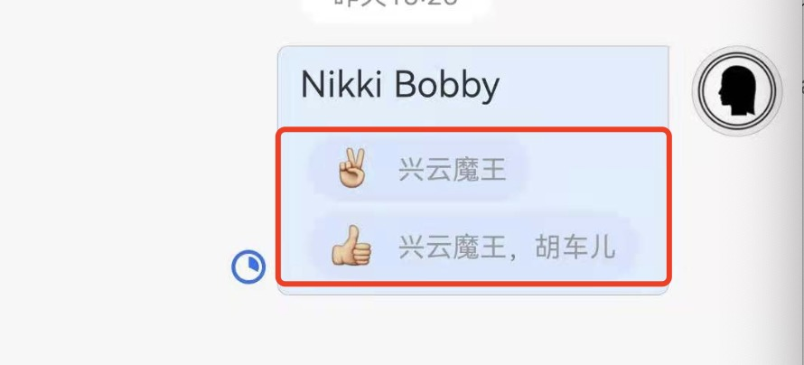

消息回应并不会产生新的消息，只会对操作消息进行修改。如以下效果

对此消息对象`LiMMsg`中`reactionList`字段对应了本条消息的回应数据。

### 消息点赞实现步骤

* 1、app点赞时调用自己服务接口处理消息点赞操作
* 2、收到同步消息回应cmd时同步消息后调用同步消息回应接口并返回给sdk
* 3、监听刷新消息事件刷新UI

>以上只是狸猫demo的实现方式，用户可按照自己的业务实现该功能。具体可参考`LiMMsgManager`的`setSyncMsgReaction()`方法。