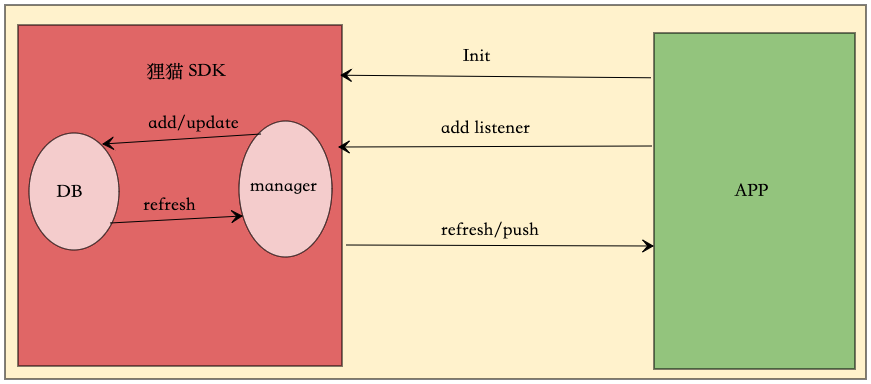

### <font color='#2196F3' size=3>sdk流程</font>



如上图所示。sdk和app直接关系及流程：app初始化sdk并添加事件监听，sdk在收发消息时都会先存库后再通知到app更新到UI。app调用sdk中的方法修改数据库，sdk也会通知UI做对应的刷新。

### <font color='#2196F3' size=3>重要的管理类</font>
* `LiMConnectionManager` 连接管理。sdk中所有的连接监听，退出，连接im均是该类处理。
* `LiMMsgManager` 消息管理。处理查看某个会话的历史记录，查询某条消息，搜索消息，删除某条消息，监听新消息等。
* `LiMConversationManager` 会话管理。处理修改某个会话的未读数量，获取最近最近会话列表等。最近会话管理可获取到`LiMReminderManager` 提醒管理。提醒管理可对最近会话增加强提醒效果，如：[有人@你][草稿][群审核]等。
* `LiMChannelManager` 频道管理。对某个频道的置顶、免打扰、禁言、资料更新等均是该类处理。
* `LiMChannelMembersManager` 频道成员管理。频道成员管理是对应于频道管理，可查询某个频道的所有成员等。
* `LiMCMDManager` cmd命令管理。sdk内部通讯信息不会显示在UI上的消息管理。比如好友修改头像、对方离线在线状态、频道成员更改等，都是通过命令管理处理。

><font color='#999' size=2>注：所有的管理类都是通过`LiMaoIM.getInstance()`获取，不需要单独创建对应的类。如获取消息管理：`LiMaoIM.getInstance().getLiMMsgManager()`</font>

### <font color='#2196F3' size=3>事件监听说明</font>
狸猫SDK中的事件分为两种：
* 需要传递`listener_key`的事件。该类事件支持多个监听，且都会收到监听回掉，并支持移除对应`listener_key`的监听
* 不需要`listener_key`的事件。不支持多个监听，多次监听会将最新的监听覆盖旧的监听。

><font color=#999 size=2>注：sdk所有的事件回掉都在主线程</font>

### <font color='#2196F3' size=3>数据库说明</font>
sdk中的数据库基本上满足了绝大部分的im业务，因此我们不需要也不建议更改数据库设计。如果您有特殊业务需要升级数据时，我们建议您按以下步骤升级数据库
* 在`assets/lim_sql`文件中新建一个大于所有文件名的数字的并且后缀名为`sql`的文件，这里以当期日期为例
如下图


* 在新建文件中编写sql语句，sql语句中不能包含注释不然会运行报错
* 将`LiMDBHelper`文件中的`version`字段加一

对此数据库升级就完成了，每次升级只需要按照上面的步骤执行即可。具体升级实现请查看`com.xinbida.limaoim.db.LiMDBUpgrade`文件

### <font color='#2196F3' size=3>联系人资料对接</font>
一般情况下如果sdk中没有某个频道资料时，sdk会通知到UI层获取频道资料。在获取网络资料时UI会显示频道的默认头像和名称，如果是用户好友时，显示默认头像这种体验非常不好。因此我们可以提前将好友的资料对接到sdk中，这样在收到用户信息时能第一时间显示用户的头像和名称。

**<font color='#2196F3' size=3>添加或修改多个频道</font>**
```java
LiMaoIM.getInstance().getLiMChannelManager().addOrUpdateChannels(liMChannelList);
```
参数说明:
| 参数           | 类型             | 说明     |
| -------------- | ---------------- | -------- |
| liMChannelList | List<LiMChannel> | 频道集合 |

><font color='#999' size=2>注：由于sdk中并没有好友或用户的概念，对此你可以通过channel中的`follow`字段标记为好友关系。更多关于`LiMChannel`中的字段请查看`com.xinbida.limaoim.entity.LiMChannel`文件</font>