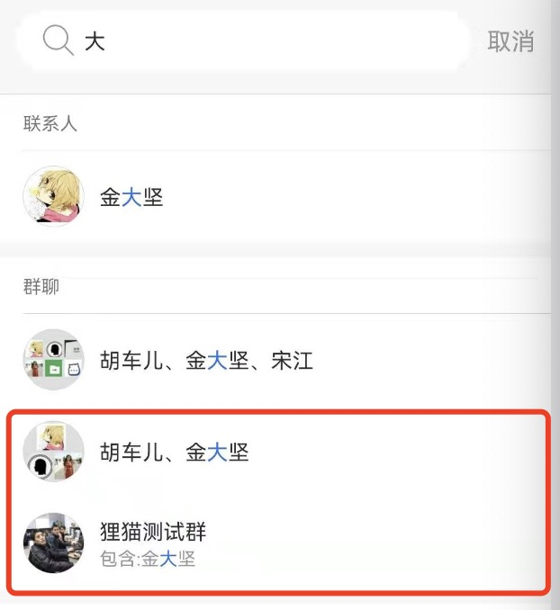

### <font color='#2196F3'>概念</font>
什么叫‘频道’。我们常见的个人、群、公众号等只是对于的聊天ID和聊天类型不同，但他们都是在同一个消息通道中收发消息。因此狸猫IM将这些个人、群或公众号统一称之为：‘频道（Channel）’。

**<font color='#2196F3'>sdk内置频道类型</font>**
* 1：个人（`LiMChannelType.PERSONAL`）
* 2：群（`LiMChannelType.GROUP`）

**<font color='#2196F3'>查询某个channel</font>**
```java
LiMaoIM.getInstance().getLiMChannelManager().getLiMChannel(channelId, channelType);
```

当用户或群特别多时，用户希望通过搜索来定位到某个群，或者某个群内的成员。如下图所示



狸猫sdk提供了搜索本地所有包含某个关键词的频道和频道成员的方法

**<font color='#2196F3'>搜索频道及成员</font>**
```java
LiMaoIM.getInstance().getLiMChannelManager().search(searchKey)
```

在狸猫SDK中并没有用户好友的概念，但是也是支持好友的信息存储及查询。如果你对接了联系人资料在sdk中，可通过以下方法查询用户好友列表
```java
LiMaoIM.getInstance().getLiMChannelManager().getChannelsWithFollowAndStatus(LiMChannelType.PERSONAL, 1, 1);
```
><font color='#999' size=2>注：通过`follow`和`status`字段查询频道信息，传入参数由用户在对接用户联系人资料在sdk所决定。联系人资料对接详情请查看[联系人资料对接](/content/zh/docs/Android/_index.md)</font>

**<font color='#2196F3'>刷新频道缓存信息</font>**
```java
LiMaoIM.getInstance().getLiMChannelManager().refreshChannelCache(liMChannel);
```

**<font color='#2196F3'>添加或修改频道</font>**
```java
LiMaoIM.getInstance().getLiMChannelManager().addOrUpdateChannel(liMChannel);
```

为了收到消息第一时间显示channel的头像和名称，用户在登录后，获取到用户好友列表时可以先将好友资料提前注册到sdk中

**<font color='#2196F3'>批量保存频道</font>**
```java
LiMaoIM.getInstance().getLiMChannelManager().addOrUpdateChannels(list);
```
><font color='#999' size=2>注：用户也可以在初始化sdk完成后，批量导入频道信息。如登录用户的好友等`channel`的`follow`字段可以指定频道关系。</font>

如果用户想手动更改sdk中channel的缓存信息只需调用以下方法，该方法会通知到UI重新从网络获取对应的channel信息。

**<font color='#2196F3'>刷新频道</font>**
```java
LiMaoIM.getInstance().getLiMChannelManager().fetchChannelInfo(channelID,channelType);
```

**<font color='#2196F3'>设置频道置顶</font>**
```java
LiMaoIM.getInstance().getLiMChannelManager().updateTop(channelID,channelType, isTop);
```
**<font color='#2196F3'>设置频道免打扰</font>**
```java
LiMaoIM.getInstance().getLiMChannelManager().updateMute(channelID,channelType, isMute);
```
**<font color='#2196F3'>修改频道扩展信息</font>**
```java
LiMaoIM.getInstance().getLiMChannelManager().updateExtra(channelID,channelType, HashMap)
```

### <font color='#2196F3'>事件</font>

**<font color='#2196F3'>获取频道信息</font>**

LiMaoIm SDK中会判断本地是否有频道资料。如果sdk中没有频道资料会调用上层设置的`addGetChannelInfoListener`监听来获取指定的频道信息。
```java
LiMaoIM.getInstance().getLiMChannelManager().addOnGetChannelInfoListener(new IGetChannelInfo() {
            @Override
            public LiMChannel onGetChannelInfo(String channelID, byte channelType, IChannelInfoListener iChannelInfoListener) {
                if (channelType == LiMChannelType.PERSONAL) {
                     // todo 获取个人信息
                } else {
                    // todo 获取群信息
                }
                return null;
            }
        });
```
><font size=2 color='#999'>注：如果UI层有该用户或群信息就直接返回对于数据。如果没有需从网络请求后再回掉给sdk这里就直接返回null。从网络获取信息后调用频道的`refreshChannelCache`方法刷新频道信息。</font>


**<font color='#2196F3'>频道信息改变监听</font>**
```java
LiMaoIM.getInstance().getLiMChannelManager().addOnRefreshChannelInfo("listener_key", new IRefreshChannel() {
            @Override
            public void onRefreshChannel(LiMChannel liMChannel) {
                // todo
            }
        });
```
